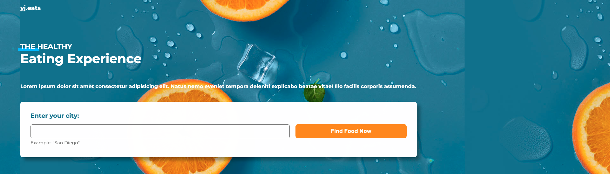

# FOOD

https://yoonjuhwang01.github.io/FOOD/

 

## Phone Size

## Coding style

### HTML & CSS

Refer to the [Google HTML/CSS Style Guide](https://google.github.io/styleguide/htmlcssguide.html).

### JavaScript

Check out the [Google JavaScript Style Guide](https://google.github.io/styleguide/jsguide.html).

## Deployment

Demonstrate how to deploy the website to production. 
